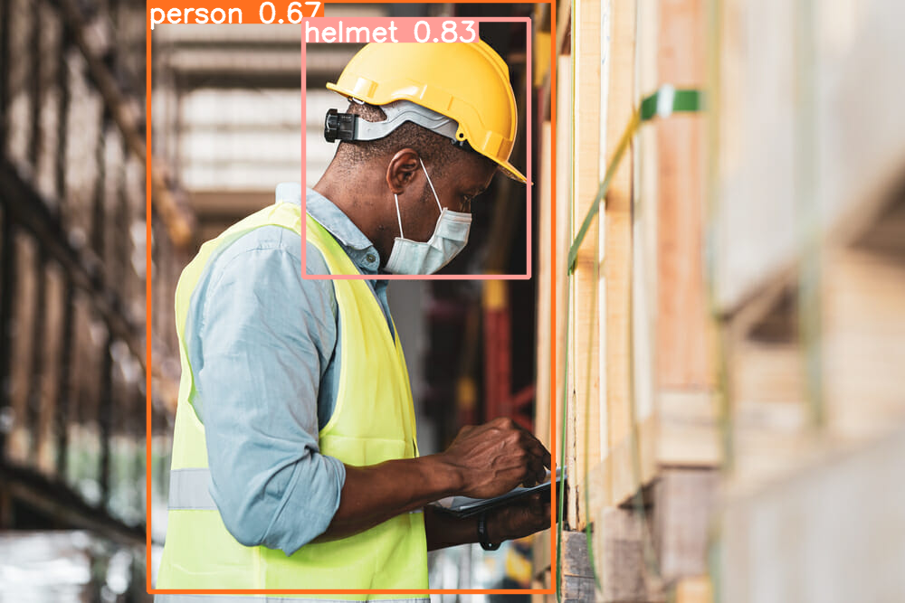

# Helmet Safety Detection
## Introduction
Welcome to my **Helmet Safety Detection** project - my submission for the first module of an AI Course, your go-to solution for ensuring safety on construction sites and roads! This project shows the power of YOLOv10 to detect whether people are wearing helmets in images. It's perfect for checking if workers are safe on their job or if motorcyclists are following safety regulations. 🚧🛵 

🚀 This project is designed to run on Google Colab, making it easy for anyone to get started. 
## How to Install?
1. **Clone the repository:**
   ```sh
    git clone https://github.com/hannguyen2880/Helmet-Safety-Detection.git
    cd Helmet-Safety-Detection
    ```
2. **Setup Google Colab:**
- [Click here to open the Colab notebook](https://colab.research.google.com/) and log into your account.
- Open the provided Colab notebook ('Helmet_Safety_Detection.ipynb') that was just cloned or open [this link](https://colab.research.google.com/drive/1hhFJXfevET6Z8orRoBw-RGGiBl_DYnf5?usp=sharing) to access the project and create a copy.
- Change the run time of your notebook from CPU to GPU.
3. **Intall the required dependencies:**
  - You can see all essential packages in 'requirements.txt" file in 'data/Safety_Helmet_Dataset.zip'. For detail, read it in the notebook file.
  
## Running the Project
- Follow steps-by-steps in Google Colab to run this project. Resources for this project are all in folder (./data/) in the cloned folder.

## The predicted image of this model
The model will annotate the image with bounding boxes around persons and helmets detected, along with confidence scores.


## Conclusion
**Thanks very much** for checking out the Helmet Safety Detection project! I hope that you had a great experience. If you have any questions or feedback, feel free to reach out.